# Self-Improving Clinic Scheduling Agent

A multi-turn patient scheduling agent (book, reschedule, cancel) with a three-layer evaluation harness and an improvement loop. When a scenario fails, a reflector proposes a small policy patch. The full eval is re-run, and a regression gate accepts the patch or rolls it back.

Built for the 2care.ai Software Engineer (AI / Agents) take-home.

## Quick start

```bash
git clone https://github.com/pprathik07/self-improving-clinic-agent
cd self-improving-clinic-agent
cp .env.example .env        # add one provider key and four model slugs (see Configuration)
uv sync --all-extras

make agent      # talk to the agent:   uv run python -m clinic_agent
make improve    # run the improve loop: uv run python -m clinic_agent.loop.improve
```

Also: `make eval` scores the current policy, and `make test` runs 305 tests offline (mock LLM, no network, no API key needed).

`make improve` starts from the latest real baseline in `runs/`. To create one first:
`uv run python -m clinic_agent.evals policy/policy_v1.yaml 1` (the last number is k, runs per scenario).

## Results at a glance

All runs are real Gemini runs at **k=1**. Agent `gemini-3.1-flash-lite`, simulator `gemini-3.5-flash-lite`, judge `gemini-3.6-flash`.

| Run | Code | Policy | Overall | Train | Heldout | Outcome |
|---|---|---|---|---|---|---|
| `012952` | original | v1 | 10/15 | 7/9 | 3/6 | Baseline |
| `015628` | original | v2 (patched) | 8/15 | 5/9 | 3/6 | **Gate rejected, rolled back** |
| `021916` | state-machine fix | v1 | 11/15 | 6/9 | 5/6 | After a code fix (see below) |

**What the loop did.** The baseline failed `ambiguous_date`. The reflector proposed one policy sentence (try tools before escalating). The re-run showed the target still at 0%, and two scenarios that used to pass (`happy_path_book`, `medical_advice`) dropped. The gate rejected the patch, kept v1 active, and saved the patch as `policy/policy_v2.yaml.rejected`. So the loop closed with a rollback, and it did **not** produce a score improvement from a policy change.

**Why the patch could not work.** The trace for `ambiguous_date` shows the real cause. The patient gave identity and request in one message, so the session stayed in `VERIFIED` and the code blocked the tools the agent needed. No policy sentence can grant a tool the code withholds. I fixed it in code (`tests/test_verified_to_intent.py`, 3 tests) and re-ran as `021916`.

**How to read `021916`.** The code changed, so it is not a clean before/after of the loop. At k=1 a one-scenario swing is noise (train fell from 7/9 to 6/9 while heldout rose from 3/6 to 5/6). Two scenarios (`ambiguous_date`, `medical_advice`) had judge replies that were not valid JSON, which score as failures. A second bug is still open (see Known limitations).

**Why k=1.** The free-tier judge model allows about 20 calls per day, and a k=3 run needs several hundred model calls. A stronger baseline is `uv run python -m clinic_agent.evals policy/policy_v1.yaml 3` with a paid key.

Where to look: `runs/<timestamp>/results.json` (scores), `runs/<timestamp>/failures.md` (which layer caught each failure), `runs/<timestamp>/traces/` (full tool traces), `loop/CHANGELOG.md` (generated by code), `policy/policy_v2.yaml.rejected` (the rejected patch).

## How it works

### The agent
- **Safety is enforced in code, not only in the prompt.** An explicit state machine (identify, verified, intent, slot selection, confirm, execute, done, escalated) controls which tools exist in each state.
- **Guards** block writes when the patient is unverified, the action is unconfirmed, the appointment belongs to someone else, or the slot is taken.
- **The model never supplies a `patient_id`.** Identity comes from session state.
- **Three failed identity checks lock the session** and escalate to a human. Emergency symptoms stop the scheduling flow.
- **Behaviour text is data.** It lives in `policy/policy_v1.yaml` (identity, confirmation, emergency, injection, ambiguity, tone, disclosure, boundaries). The loop may edit only this file.

### The evaluation harness
- **15 scenarios** (9 train, 6 heldout). Adversarial cases outnumber happy paths: wrong DOB, lockout, emergency symptoms, medical advice, prompt injection, another patient's records, ambiguous dates, "are you a robot".
- **An LLM patient simulator** plays each persona against the agent.
- **Three scoring layers, in order of trust.** (1) Final database and session state, which is ground truth. (2) The tool-call trace. (3) An LLM judge that sees only the transcript. A scenario passes only if all three pass.
- **Why the order:** the judge can be fooled by "you're booked!" when nothing was written, so state ranks first.

### The improvement loop
1. `failures.md` is generated from a real baseline run.
2. The reflector sees **train failures only**. A leak check runs on its final prompt so heldout scenarios cannot reach it.
3. It returns one JSON patch. `patch.py` validates it: at most 3 changes, 600 characters each, known policy sections only, protected sections are add-only, no scenario ids, patient names or quoted lines. `policy_v1.yaml` is never overwritten.
4. A human reads the printed diff and approves it.
5. The full eval re-runs with the same k and scenario set.
6. `gate.py` accepts only if every target strictly improves, no fully-passing scenario drops (even by one run), heldout does not drop, and there are no error runs. Otherwise it rolls back and v1 stays active.
7. A changelog entry is generated from `results.json`.

## Configuration

Set these in `.env`, which is not tracked.

| Variable | Meaning |
|---|---|
| `MOCK_LLM` | `1` uses a deterministic fake LLM (tests). `0` uses a real provider |
| `LLM_PROVIDER` | `gemini`, `openrouter` or `auto`. Use an explicit value for real evals |
| `GEMINI_API_KEY` or `OPEN_ROUTER_API_KEY` | Provider key |
| `AGENT_MODEL`, `JUDGE_MODEL`, `SIM_MODEL`, `REFLECTOR_MODEL` | Model slugs. Real mode requires agent, judge and simulator to be three different models |

Auth and model errors (401/403/404) abort a run immediately, so a broken run never produces numbers. Per-day quota errors also abort. Per-minute rate limits retry after the server's retry delay, up to 3 times.

## Verification

```bash
make test                                    # 305 tests, mock LLM, no network
uv run python scripts/mutation_check.py      # breaks each patch.py guard; a named test must fail
uv run python scripts/freeze_manifest.py --check   # scenario, scorer and policy hashes unchanged
uv run python scripts/preflight.py           # pre-submission checks
```

- 11 patch-validator guards, each with a named failing test (0 untested).
- Scenario, scorer and policy hashes were frozen before the baseline and unchanged since.
- A caught mutation proves some test fails, not that the test is precise.
- The reflector, gate and loop are tested with fake LLMs. They ran for real once (run `015628`).

## Known limitations

- **Same-day availability bug (open).** `check_availability` returned no slots for a range where `date_start == date_end`, while a specialty-only query returned slots. Date scenarios such as `ambiguous_date` can fail for reasons no policy patch can fix. I documented it and did not fix it, to avoid changing the agent again without a clean re-measure.
- **k=1** is weak evidence. The judge is also unmeasured: no agreement rate against hand labels.
- **Judge parse failures** count as failed checks. Read the state and trace layers first.
- **The judge is transcript-only.** It cannot see tool arguments or database state.
- **The simulator is an LLM** and can drift from its persona. Data is synthetic.
- **Confirmation is a keyword match** ("yes", "sure", "go ahead") while in the confirm state. It is not bound to the exact slot or appointment. "I'm not sure" contains "sure". This is the first thing I would fix for a real clinic (see `design-note.md`).
- **The gate protects only scenarios that were fully passing before the patch.** Partially passing scenarios can still get worse.
- **The heldout leak check is lexical** (whole-text plus 8-word runs). Paraphrases pass, and single-word names are missed.
- Not production-ready: no UI, synthetic data only.

## Architecture

```mermaid
flowchart TD

subgraph group_scheduling["Scheduling Agent"]
  node_runner["Conversation Runner<br/>runner.py"]
  node_machine["State Machine<br/>machine.py"]
  node_session["Session State<br/>state.py"]
  node_policy_loader["Policy Loader<br/>policy.py"]
  node_policy_data["Policy Rules<br/>policy_v1.yaml"]
  node_llm["LLM Adapter<br/>llm.py"]
end

subgraph group_clinic["Clinic Domain"]
  node_tools["Scheduling Tools<br/>impl.py"]
  node_guards["Safety Guards<br/>guards.py"]
  node_db[("Clinic Database<br/>db.py")]
  node_models["Clinic Models<br/>models.py"]
end

subgraph group_evaluation["Evaluation Harness"]
  node_eval_runner["Scenario Eval Runner<br/>run_eval.py"]
  node_scenario_schema["Scenario Schema<br/>scenario_schema.py"]
  node_simulator["Patient Simulator<br/>simulator.py"]
  node_scorers["State And Trace Scorers<br/>scorers.py"]
  node_judge["LLM Judge<br/>judge.py"]
  node_failures["Failure Reports<br/>failures.py"]
  node_report["Results Report<br/>report.py"]
end

subgraph group_improvement["Policy Improvement"]
  node_improve["Improvement Orchestrator<br/>improve.py"]
  node_reflector["Failure Reflector<br/>reflector.py"]
  node_patch["Patch Validator<br/>patch.py"]
  node_gate["Regression Gate<br/>gate.py"]
end

node_patient(("Patient"))

node_patient -->|"converses with"| node_runner
node_runner -->|"loads policy"| node_policy_loader
node_policy_loader -->|"reads rules"| node_policy_data
node_runner -->|"checks transitions"| node_machine
node_runner -->|"tracks conversation"| node_session
node_runner -->|"requests responses"| node_llm
node_runner -->|"dispatches tool calls"| node_tools
node_tools -->|"applies checks"| node_guards
node_tools -->|"reads and writes"| node_db
node_guards -->|"checks ownership and slots"| node_db
node_db -->|"uses domain types"| node_models
node_eval_runner -->|"loads scenarios"| node_scenario_schema
node_eval_runner -->|"runs patient turns"| node_simulator
node_eval_runner -->|"executes conversations"| node_runner
node_eval_runner -->|"scores outcomes"| node_scorers
node_eval_runner -->|"requests assessment"| node_judge
node_eval_runner -->|"records failures"| node_failures
node_simulator -->|"generates patient turns"| node_llm
node_judge -->|"requests judgment"| node_llm
node_improve -->|"runs evaluations"| node_eval_runner
node_improve -->|"prepares failure summaries"| node_failures
node_improve -->|"requests patch proposal"| node_reflector
node_reflector -->|"produces structured patch"| node_patch
node_improve -->|"validates patch"| node_patch
node_patch -->|"writes policy sections"| node_policy_data
node_improve -->|"checks regression results"| node_gate
node_improve -->|"renders comparison"| node_report

classDef toneBlue fill:#dbeafe,stroke:#2563eb,stroke-width:1.5px,color:#172554
classDef toneAmber fill:#fef3c7,stroke:#d97706,stroke-width:1.5px,color:#78350f
classDef toneMint fill:#dcfce7,stroke:#16a34a,stroke-width:1.5px,color:#14532d
classDef toneRose fill:#ffe4e6,stroke:#e11d48,stroke-width:1.5px,color:#881337
classDef toneIndigo fill:#e0e7ff,stroke:#4f46e5,stroke-width:1.5px,color:#312e81
class node_runner,node_machine,node_session,node_policy_loader,node_policy_data,node_llm toneBlue
class node_tools,node_guards,node_db,node_models toneAmber
class node_eval_runner,node_scenario_schema,node_simulator,node_scorers,node_judge,node_failures,node_report toneMint
class node_improve,node_reflector,node_patch,node_gate toneRose
class node_patient toneIndigo
```



## More

- `design-note.md`: one-page design note, including the one change I would make for a real clinic.
- `AI_USAGE.md`: where AI helped and where my own judgment overrode it.