# Self-Improving Clinic Scheduling Agent

A multi-turn patient scheduling agent (book / reschedule / cancel) with an evaluation
harness and an improvement loop. When a scenario fails, a reflector proposes a small,
validated patch to the agent's policy text. The same scenarios are re-run, and a gate
accepts the patch or rolls it back.

## Tech stack

| | |
|---|---|
| **Language** | Python 3.12 · Pydantic v2 · YAML policy |
| **Runtime** | `uv` · Makefile CLIs · pytest (305 tests, mock LLM) |
| **Agent** | Explicit state machine + tool loop (no LangGraph/CrewAI) |
| **Data** | SQLite (seeded clinic DB; scorers use ground truth) |
| **LLM** | Thin `llm.py` adapter · OpenRouter / Gemini · 4 env-selected roles |
| **Evals** | 15 YAML scenarios · DB/trace/judge scorers · heldout set |
| **Loop** | Reflector → validated policy patch → regression gate |

## Run it

    git clone https://github.com/pprathik07/self-improving-clinic-agent
    cd self-improving-clinic-agent
    cp .env.example .env        # add a provider key and model slugs
    uv sync --all-extras

    make agent      # talk to the agent:        uv run python -m clinic_agent
    make improve    # run the improvement loop: uv run python -m clinic_agent.loop.improve

Also available: `make eval` (score the current policy) and `make test` (305 tests,
no network, mock LLM).

## Status (read this first)

**Agent, eval harness, and improvement loop are built.** Real Gemini evals at `k=1`
(see Results). Best current score after a state-machine fix: **11/15 (73%)** on
`policy_v1`. An earlier v1→v2 policy patch was **gate-rejected** and rolled back.
No mock numbers are reported as scores.

What else is verified:

- 305 passing tests, 0 skipped, mock LLM / no network.
- Mutation checks on the policy-patch validator: 11 guards, 0 untested.
- Frozen scenario, scorer and policy hashes (`scripts/freeze_manifest.py --check`).
- One live booking on a real model (verify → slot → confirm → DB write).

Limits: `k=1` only (quota). A stronger baseline is:

    uv run python -m clinic_agent.evals policy/policy_v1.yaml 3

## How it works

- **Safety is enforced in code, not only in the prompt.** A state machine limits which tools
  exist in each state. Tool guards block writes when the patient is unverified, the action
  is unconfirmed, the appointment belongs to someone else, or the slot is taken. The model
  never supplies a `patient_id`; identity comes from session state. Three failed
  verifications lock the session and escalate to a human.
- **Policy is data.** Behaviour text lives in `policy/policy_v1.yaml`. The loop may edit
  only this file.
- **Three scoring layers, in order of trust:** (1) database and session state, (2) tool-call
  trace, (3) an LLM judge that sees only the transcript. A scenario passes only if all three
  pass.
- **15 scenarios** (9 train, 6 heldout). Adversarial cases outnumber happy paths: wrong DOB,
  lockout, emergency symptoms, medical advice, prompt injection, another patient's records,
  ambiguous dates, "are you a robot".
- **The loop:**
  1. `failures.md` is generated from a real baseline run.
  2. The reflector reads train failures only and returns one JSON patch.
  3. `patch.py` validates it: at most 3 changes, 600 characters each, known sections only,
     protected sections are add-only, no scenario ids, patient names or quoted lines,
     `policy_v1.yaml` is never overwritten.
  4. I approve the printed diff.
  5. The full eval is re-run with the same k and scenario set.
  6. `gate.py` accepts or rolls back, and a CHANGELOG entry is generated from `results.json`.
- **Gate rules:** every target scenario must strictly improve; no fully-passing scenario may
  drop (even by one run); the heldout aggregate must not drop; no error runs.

## Configuration

| Variable | Meaning |
|---|---|
| `MOCK_LLM` | `1` uses a deterministic fake LLM (tests); `0` uses a real provider |
| `LLM_PROVIDER` | `openrouter`, `gemini` or `auto`. Use an explicit value for real evals |
| `OPEN_ROUTER_API_KEY`, `GEMINI_API_KEY` | Provider keys. Keep them in `.env`, which is untracked |
| `AGENT_MODEL`, `JUDGE_MODEL`, `SIM_MODEL`, `REFLECTOR_MODEL` | Model slugs. Real mode requires agent, judge and simulator to be three different models |

Fatal auth/model errors (401/403/404) abort a run immediately. Rate limits (429) are
classified by quota id: per-day limits abort, per-minute limits retry after the server's
retry delay, up to 3 times.

## Results

<!-- RESULTS:START -->
Real Gemini evals, `k=1`. Models: agent `gemini-3.1-flash-lite`, judge `gemini-3.6-flash`, sim `gemini-3.5-flash-lite`.

| Run | Code | Policy | Result |
|---|---|---|---|
| `012952` | original | v1 | **10/15** (train 7/9, heldout 3/6) |
| `015628` | original | v2 | **8/15**, gate rejected (rolled back) |
| `021916` | state fix | v1 | **11/15** (train 6/9, heldout 5/6); judge parse failures on `ambiguous_date`, `medical_advice` |
<!-- RESULTS:END -->

## Verification

    make test                              # 305 tests, mock LLM
    uv run python scripts/mutation_check.py   # patch.py guards: each must have a failing test
    uv run python scripts/freeze_manifest.py --check
    uv run python scripts/preflight.py --pre-real

A caught mutation proves that some test fails, not that the test is precise.

## Known limitations

- The judge is transcript-only; it cannot see database state or tool arguments.
- The simulator is an LLM and can drift. k is small. Data is synthetic.
- The gate protects only scenarios that were fully passing before the patch; partially
  passing scenarios can still get worse.
- The heldout leak check is lexical (whole-text plus 8-word runs). Paraphrases pass, and
  single-word names are missed.
- Confirmation is detected by keyword match on the patient's message, not bound to the exact
  action (see `design-note.md`).
- `check_availability` returned no slots for a same-day start/end range that a
  specialty-only query did return. Date scenarios may fail for reasons no policy patch can fix.
- Not production-ready: no UI, synthetic data only.

## Architecture

```mermaid
flowchart TD

subgraph group_scheduling["Scheduling Agent"]
  node_runner["Conversation Runner<br/>runner.py"]
  node_machine["State Machine<br/>machine.py"]
  node_session["Session State<br/>state.py"]
  node_policy_loader["Policy Loader<br/>policy.py"]
  node_policy_data["Policy Rules<br/>policy_v1.yaml"]
  node_llm["LLM Adapter<br/>llm.py"]
end

subgraph group_clinic["Clinic Domain"]
  node_tools["Scheduling Tools<br/>impl.py"]
  node_guards["Safety Guards<br/>guards.py"]
  node_db[("Clinic Database<br/>db.py")]
  node_models["Clinic Models<br/>models.py"]
end

subgraph group_evaluation["Evaluation Harness"]
  node_eval_runner["Scenario Eval Runner<br/>run_eval.py"]
  node_scenario_schema["Scenario Schema<br/>scenario_schema.py"]
  node_simulator["Patient Simulator<br/>simulator.py"]
  node_scorers["State And Trace Scorers<br/>scorers.py"]
  node_judge["LLM Judge<br/>judge.py"]
  node_failures["Failure Reports<br/>failures.py"]
  node_report["Results Report<br/>report.py"]
end

subgraph group_improvement["Policy Improvement"]
  node_improve["Improvement Orchestrator<br/>improve.py"]
  node_reflector["Failure Reflector<br/>reflector.py"]
  node_patch["Patch Validator<br/>patch.py"]
  node_gate["Regression Gate<br/>gate.py"]
end

node_patient(("Patient"))

node_patient -->|"converses with"| node_runner
node_runner -->|"loads policy"| node_policy_loader
node_policy_loader -->|"reads rules"| node_policy_data
node_runner -->|"checks transitions"| node_machine
node_runner -->|"tracks conversation"| node_session
node_runner -->|"requests responses"| node_llm
node_runner -->|"dispatches tool calls"| node_tools
node_tools -->|"applies checks"| node_guards
node_tools -->|"reads and writes"| node_db
node_guards -->|"checks ownership and slots"| node_db
node_db -->|"uses domain types"| node_models
node_eval_runner -->|"loads scenarios"| node_scenario_schema
node_eval_runner -->|"runs patient turns"| node_simulator
node_eval_runner -->|"executes conversations"| node_runner
node_eval_runner -->|"scores outcomes"| node_scorers
node_eval_runner -->|"requests assessment"| node_judge
node_eval_runner -->|"records failures"| node_failures
node_simulator -->|"generates patient turns"| node_llm
node_judge -->|"requests judgment"| node_llm
node_improve -->|"runs evaluations"| node_eval_runner
node_improve -->|"prepares failure summaries"| node_failures
node_improve -->|"requests patch proposal"| node_reflector
node_reflector -->|"produces structured patch"| node_patch
node_improve -->|"validates patch"| node_patch
node_patch -->|"writes policy sections"| node_policy_data
node_improve -->|"checks regression results"| node_gate
node_improve -->|"renders comparison"| node_report

classDef toneBlue fill:#dbeafe,stroke:#2563eb,stroke-width:1.5px,color:#172554
classDef toneAmber fill:#fef3c7,stroke:#d97706,stroke-width:1.5px,color:#78350f
classDef toneMint fill:#dcfce7,stroke:#16a34a,stroke-width:1.5px,color:#14532d
classDef toneRose fill:#ffe4e6,stroke:#e11d48,stroke-width:1.5px,color:#881337
classDef toneIndigo fill:#e0e7ff,stroke:#4f46e5,stroke-width:1.5px,color:#312e81
class node_runner,node_machine,node_session,node_policy_loader,node_policy_data,node_llm toneBlue
class node_tools,node_guards,node_db,node_models toneAmber
class node_eval_runner,node_scenario_schema,node_simulator,node_scorers,node_judge,node_failures,node_report toneMint
class node_improve,node_reflector,node_patch,node_gate toneRose
class node_patient toneIndigo
```

## Layout

    clinic_agent/
      clinic/    DB schema, seed data, frozen clock
      tools/     tool functions and guards
      agent/     state machine, runner, policy loader
      evals/     scenarios, simulator, scorers, judge, failures/report/calibrate
      loop/      patch, reflector, gate, improve, CHANGELOG
      llm.py     the only file that imports an LLM SDK
    policy/      policy_v1.yaml (policy_v2.yaml is generated by the loop)
    scripts/     mutation_check, freeze_manifest, smoke_llm, preflight
    tests/

See `design-note.md` for design choices.